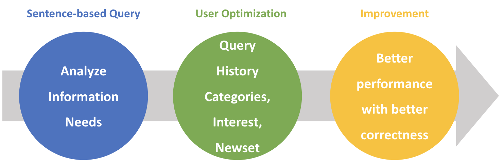
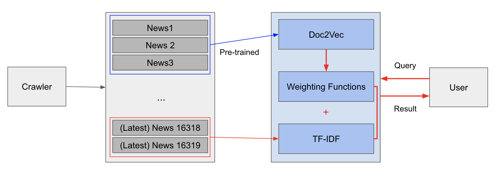

## About Hoogle
Doc2vec based news article search engine. Reconstructed with Django Framework.
To increase search engine queality of herald korea, 
especially for multi-words-query such as "death penalty", "Effective ways to educate the people",
Hoogle adopted doc2vec based similarity inferrence search engine model, not searching just by query matching. 
Through below several steps, it catches the meaning of given several words, counts on the user search history and matches information needs of user and qeury results.

## Getting started
    1. clone the repository
    
    2. change directory to the project
    
    3. execute docker-compose with command 'docker-compose up'
    
    4. access http://localhost:18267 through browser     
## Live demo
You can find a running system to test at test.test.test.
 
## Architecture
1. user access to hoogle through frontend react.

2. nginx route the http request to django web application.

3. django parse the user input query, tokenize through nlp core engine.

4. nlp engine calculate similarity between pre-parsed articles and user input query.

    4-1. recently parsed articles are calculated with tf-idf, cosine similarity because they are not included in doc2vec model. 

5. weight scores are added to each ranked articles.

6. finally return articles relevant to user input query.

## Core Search Engine
#### Structure
#### Weight Functions

    WEIGHT_SIMILARITY: 
        
    WEIGHT_LATEST: 
        
    WEIGHT_TERM_FREQUENCY:
        
    WEIGHT_IDF:

## Evaluation

    Precision - Query Test
    
    1. "BTS NEW" 
    
    2. "BTS NEW ALBUM"
    
    3. "IMPACT OF BITCOIN ON WORLD"

